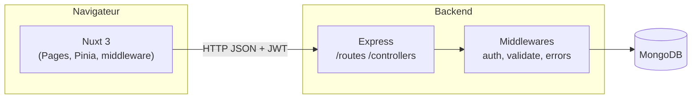

# PULSE — Bracelet NFC Fitness & Lifestyle


> Application fullstack autour d'un bracelet NFC connecté pour le suivi d'activité, le partage de profil sportif et l'accès à du contenu personnalisé.

> Stratégie QA complète disponible dans [QA.md](./QA.md).

## Concept

**PULSE** est un bracelet NFC qui permet à l'utilisateur de :

- suivre son activité (séances, distance, durée, calories)
- accéder à un profil ou contenu personnalisé via tap NFC
- partager ses performances et habitudes via une page publique
- débloquer du contenu fitness associé à son bracelet

## Architecture

### Dépôt

```
NFC/
├── backend/        API Node.js + Express + MongoDB (Mongoose, JWT)
├── frontend/       Application Nuxt 3 (marketing + e-commerce + SaaS)
└── README.md
```

### Vue d'ensemble

Le **frontend Nuxt 3** consomme une **API REST** exposée par **Express** sur le préfixe `/api`. Les données persistantes vivent dans **MongoDB** via **Mongoose**. L’authentification repose sur des **JWT** : le token est stocké côté client (Pinia) et renvoyé dans l’en-tête `Authorization: Bearer …` par le composable `useApi`.



- **CORS** : origine configurable (`credentials: true`) pour que le front (souvent autre port / domaine) puisse envoyer les cookies si besoin et les en-têtes d’auth.
- **Santé** : `GET /api/health` pour vérifier que l’API répond.

### Backend — organisation en couches

| Couche | Rôle |
| ------ | ---- |
| **Routes** (`src/routes/*.routes.js`) | Monte les chemins HTTP et applique les middlewares (auth, validation). |
| **Controllers** (`src/controllers/*.js`) | Orchestration : lecture `req`, appels modèles/services, `res.json` / codes HTTP. |
| **Validators** (`src/validators/*.schema.js`) | Schémas **Joi** pour le corps / params des requêtes mutantes. |
| **Models** (`src/models/*.js`) | Schémas Mongoose, méthodes d’instance (`toPublicJSON`, etc.). |
| **Services** (`src/services/`) | Logique transverse (ex. **token.service** pour JWT). |
| **Middlewares** | `requireAuth` / `optionalAuth` (JWT + chargement utilisateur), `validate`, `errorHandler`, `notFound`, `requestLogger`. |

**Point d’entrée** : `server.js` charge la config (`config/env.js`, `config/db.js`), connecte MongoDB, puis monte `app.js` (enregistrement global des middlewares Express et du montage des routes).

**Surface API** (toutes sous `/api`) :

| Préfixe | Domaine |
| ------- | ------- |
| `/api/auth` | Inscription, connexion, tokens |
| `/api/users` | Profil utilisateur |
| `/api/bracelets` | Bracelets NFC (propriétaire, tag, mode de redirection) |
| `/api/activities` | Séances / stats |
| `/api/products` | Catalogue |
| `/api/cart` | Panier |
| `/api/orders` | Commandes |
| `/api/content` | Blocs marketing (FAQ, témoignages, etc.) |
| `/api/public` | Profil public par **handle**, simulation **tap NFC** (`/nfc/:tagId`) |

Les erreurs métier passent par **`ApiError`** et sont normalisées par le **gestionnaire d’erreurs** central.

### Frontend — organisation

| Zone | Rôle |
| ---- | ---- |
| **Pages** (`pages/`) | Marketing, boutique, checkout, auth, espace `/app/*`, routes publiques `/u/:handle` et `/nfc/:tagId`. |
| **Stores Pinia** (`stores/`) | `auth` (session + token), `cart` (panier persistant côté client + sync API). |
| **Composable `useApi`** | Base URL depuis `runtimeConfig.public.apiBase`, injection automatique du **Bearer JWT**. |
| **Middleware `auth`** | Protection des routes `/app/*` : restauration session puis redirection vers `/login?redirect=…` si non connecté. |
| **Plugin `auth.client`** | Initialisation / restauration de l’auth au chargement côté client. |

Le même utilisateur et le même JWT servent à la fois au **parcours SaaS** (tableau de bord, bracelets, activités) et au **parcours e-commerce** (panier, commande).

### Modèle de données (vue métier)

Les entités principales sont reliées ainsi : un **User** possède des **NFCBracelets** et des **Activities** ; le catalogue **Product** alimente le **Cart** puis les **Orders** ; le **Content** structure les sections éditoriales du site. Les profils publics s’appuient sur le **handle** unique ; le tap NFC résout un **tagId** vers un bracelet puis éventuellement une URL personnalisée ou la page `/u/:handle`.

### Stack technique

| Couche      | Technologies                                                        |
| ----------- | ------------------------------------------------------------------- |
| Backend     | Node.js, Express, MongoDB, Mongoose, JWT, bcrypt, Joi, Jest         |
| Frontend    | Nuxt 3, Vue 3, Pinia, Tailwind CSS, GSAP-like animations CSS        |
| Design      | Dark mode, glassmorphism, néons cyan/violet, motion fluide          |

### Authentification

Un seul système d'authentification (JWT) partagé entre le **SaaS** et l'**e-commerce**. Un utilisateur inscrit peut :

- gérer son profil et ses bracelets (SaaS)
- passer commande sur l'e-commerce
- partager une page publique de son activité

## Démarrage rapide

### 1. Backend

```bash
cd backend
cp .env.example .env       # configure MONGO_URI et JWT_SECRET
npm install
npm run seed               # insère produits + contenu marketing
npm run dev                # http://localhost:4000
```

### 2. Frontend

```bash
cd frontend
cp .env.example .env       # NUXT_PUBLIC_API_BASE=http://localhost:4000/api
npm install
npm run dev                # http://localhost:3000
```

### 3. Routes principales

| Section    | URL                          |
| ---------- | ---------------------------- |
| Marketing  | `/`, `/features`, `/about`, `/contact` |
| E-commerce | `/shop`, `/shop/:slug`, `/cart`, `/checkout` |
| Auth       | `/login`, `/register`        |
| SaaS       | `/app/dashboard`, `/app/profile`, `/app/activities`, `/app/bracelets` |
| Public NFC | `/u/:handle` (page partageable du profil)        |
| Tap NFC    | `/nfc/:tagId` (simulation d'un tap NFC)          |

## Fonctionnalités

### Backend (API REST)

- Inscription / connexion / JWT
- CRUD utilisateur, profil public partageable
- CRUD bracelets NFC associés à un utilisateur
- CRUD activités sportives (course, vélo, muscu, yoga…)
- Catalogue produits + variantes
- Panier & validation de commande
- Contenu marketing dynamique (sections, FAQ, témoignages)
- Middleware de logs, validation Joi, erreurs centralisées
- Tests Jest

### Frontend

- Site marketing responsive et SEO-ready
- E-commerce avec panier persistant (Pinia)
- Espace SaaS : dashboard d'activités, gestion profil, gestion bracelets
- Page publique `/u/:handle` partageable
- Simulation d'un tap NFC `/nfc/:tagId`

## Tests

```bash
# Tests d'intégration backend (Jest + Supertest + MongoDB in-memory)
cd backend && npm test

# Tests frontend unitaires et d'intégration (Vitest + @nuxt/test-utils)
cd frontend && npm test

# Tests E2E (Playwright — nécessite backend + frontend démarrés)
cd frontend && npm run test:e2e

# Tests E2E avec interface graphique Playwright
cd frontend && npm run test:e2e:ui
```

Voir [QA.md](./QA.md) pour la stratégie de tests complète.

## Auteur

Projet pédagogique — concept fitness/lifestyle (option 3).
